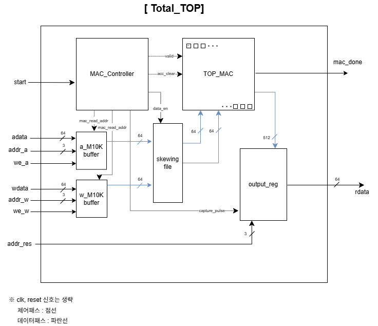
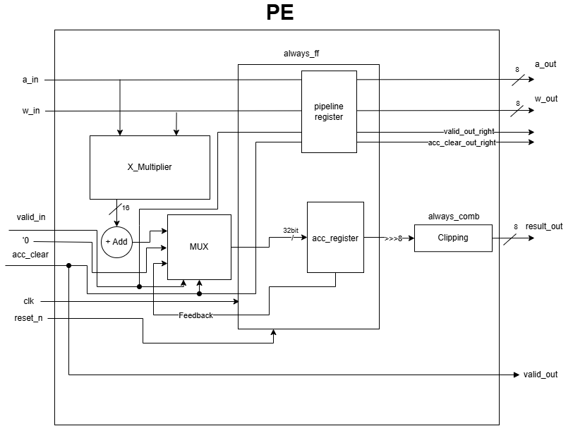

# 8x8 Systolic Array 기반 MAC 코어(v2.0)

## Project Overview
엣지 디바이스 환경을 타겟으로 한 고성능·저면적 행렬 곱셈 하드웨어 가속기 IP 설계 프로젝트입니다.
초기 설계의 물리적 I/O 한계를 극복하기 위한 내부 버퍼와 파이프라인 제어 로직을 추가하였습니다.
Python 기반의 Golden Model과 SystemVerilog RTL 설계를 교차 검증실시 하였으며 완벽하게 통과하여 설계의 무결성을 증명했습니다.

* **Target Device** : Intel Cyclone V FPGA (5CGXFC7C7F23C8)
* **Language** : SystemVerilog
* **Tools** : Quartus Prime , ModelSim, Python

## Key Architecture
1. **Output Stationary Systolic Array** : 각 PE 내부에 32bit 누산기를 고정 배치하여 중간 부분합의 데이터 이동을 없애고, 이로 인한 내부 병목 현상 제거와 동적 전력 소모를 최소화했습니다. ( 추후, 배열 확장 예정 )

    ※ 각 PE 내부에는 32-bit 누산기를 배치하여 내부 병목 현상을 제거했습니다.
2. **FSM Controller** : 연산 타이밍 제어 신호를 생성하는 3-state(IDLE->RUN->DONE)를 설계했습니다. 또한, capture_pulse를 추가하여 512bit 최종 결과를 버퍼에 한 번에 래치할 수 있도록 했습니다.
3. **PE(Datapath)** : 오버플로우를 방지하는 포화 연산 및 산술 우측 시프트 기반의 스케일링(Truncation) 로직을 하드웨어에 구현하였습니다.
4. **Skewing_file** : 64bit 병렬 입력 데이터를 8bit 단위로 슬라이싱하고, 클럭마다 대각선 형태로 밀어 넣는 계단식 지연 파이프라인을 구현했습니다.
5. **output_reg** : 메모리 매핑 기능을 수행하며 주소값에 따라 내부 버퍼에 64비트 데이터만 선택하여 rdata포트로 출력하게 했습니다.
6. **M10K_buffer** : FPGA 내부의 M10K 블록 ram으로 매핑되는 64bit 데이터 버퍼 모듈을 통합했습니다.

## Verification
* **Python Golden Model** : 하드웨어의 슬라이싱 구조 및 데이터 주입 방식을 맞추기 위해, 미리 행렬을 전치하여 완벽하게 일치하는 Reference 정답을 추출했습니다.
* **Testbench** : SystemVerilog의 '$readmemh'를 활용하여 매 클럭 자동으로 비교하고 에러를 검출하는 환경을 설계했습니다. 추가적으로, repeat를 사용하지 않고 capture_pulse를 트리거로 삼아서 검증을 시도하였습니다. 

## Simple Architecture Block Diagram

## PPA Results
* **Fmax** : 113.6 MHz
* **Computing Power** : 14.54 GOPS
* **Logic Utilization** : 1,806 ALMs
* **DSP Blocks** : 64/156(41%)
* **Timing Slack** : 1.197 ns
* **Total pins** : 207/268(77%)
* **Total block memory bits** 1,424

## Architecture 개선 과정
* **기존 문제점** : 초기 순수 MAC 코어 설계 시, 1,536bit에 달하는 2차원 배열 데이터를 외부 포트로 직접 입력받았습니다. 이를 Virtual Pin을 통해서 합성을 진행했지만 실제 칩에서는 핀 개수 부족과 극심한 I/O 라우팅 병목으로 인해 물리적으로 구현이 어려운 모델이었습니다.
*  **해결책**
1. 내부 데이터 보관용 M10K buffer 설계
2. skewing_file을 추가하여 systolic array 배열에 데이터를 순차 공급
3. 64bit 단위로 데이터를 쓰고 읽을 수 있도록 interface 설계
* **결과** : I/O 포트 사이즈를 1,536bit에서 64bit로 축소하여 혼잡도를 해결하였습니다.

## 향후 계획
**표준 시스템 버스 프로토콜 통합 예정**
